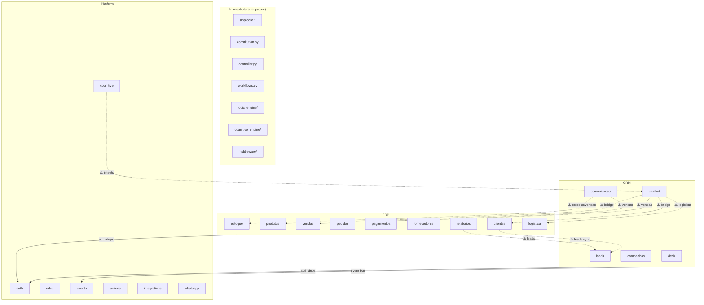

# 🗺️ Mapa de Dependências por Domínio (Censo Nacional)

> Gerado durante a FASE 4 do refactor "Modelo País" — `refactor/country-model`

## Legenda

| Símbolo | Significado |
|---------|-------------|
| ✅ | Permitido (serviço público) |
| ⚠️ | Exceção documentada (migrar para evento) |
| ❌ | Violação (deve ser corrigida) |

---

## Grafo de Dependências



---

## Acoplamentos Cross-Domínio

### ✅ Serviços Públicos (Permitidos)

Imports de `platform.auth` e `platform.events.tasks` são permitidos por todos os domínios — são serviços públicos da plataforma.

| Módulo consumidor | Import | Classificação |
|---|---|---|
| `erp.*.routes` | `platform.auth.dependencies` | ✅ Serviço público |
| `erp.*.routes` | `platform.auth.models.User` | ✅ Serviço público |
| `crm.*.routes` | `platform.auth.dependencies` | ✅ Serviço público |
| `crm.chatbot.api.routes` | `platform.integrations.dependencies` | ✅ Serviço público |
| `crm.chatbot.*.tasks` | `platform.events.tasks` | ✅ Event Bus público |

### ⚠️ Exceções Documentadas (Migrar para Eventos)

| Módulo | Import cross-domain | Plano de migração |
|---|---|---|
| `crm.comunicacao.service` | `erp.estoque.models`, `erp.vendas.service` | Migrar para evento `crm.comunicacao.precisa_dados` |
| `crm.comunicacao.repository` | `erp.estoque.models` | Extrair modelo compartilhado para `app.core` |
| `crm.chatbot.core.strategy` | `erp.logistica.models.EnvioLogistico` | Migrar para evento `erp.logistica.envio_atualizado` |
| `crm.chatbot.worker.tasks` | `erp.vendas.models.Venda` | Migrar para evento `crm.chatbot.checkout_concluido` |
| `crm.chatbot.bridge.internal.api` | `erp.clientes`, `erp.produtos`, `erp.vendas` | Exceção arquitetural (Bridge usa SyncSession) |
| `erp.relatorios.repository` | `crm.leads.models.Lead` | Migrar para SQL View materializada |
| `erp.clientes.service` | `crm.leads.service`, `crm.leads.schemas` | Migrar sync para evento bidirecional |
| `platform.cognitive.nlp.intent_matcher` | `crm.chatbot.models` | Migrar `IntentDefinition` para `platform.cognitive` |

### ❌ Violações Reais

**Nenhuma violação real detectada** pelo lint `scripts/lint_cross_domain.py`.

---

## Resumo Quantitativo

| Métrica | Valor |
|---|---|
| Total de módulos | 22 (9 ERP + 5 CRM + 7 Platform + 1 Frontend) |
| Imports cross-domínio totais | 38 |
| Serviços públicos (permitidos) | 26 |
| Exceções documentadas | 12 (8 arquivos únicos) |
| Violações reais | **0** |
| Cobertura do lint | 100% dos `.py` em `app/modules/` |

---

## Validação

```bash
# Rodar lint cross-domínio
python scripts/lint_cross_domain.py

# Modo strict (falha com exit code 1 se houver violações)
python scripts/lint_cross_domain.py --strict
```
